# Helt Normal

Vores projekt "Helt Normal" er en løsning, hvor brugeren vil møde quizzer om `Myter eller fakta`, om
`statistikker` samt nogle `personlige historier` fra folk, der enten selv har en psykisk diagnose,
eller er pårørende til en, med en psykisk diagnose. Vores løsning skal være med til at
normalisere psykiske sygdomme, samt nedbryde de fordomme og den stigmatisering, der stadig findes i samfundet.

## Validering af HTML og CSS

Vi har valideret vores CSS og HTML, for at sikre, at der ingen fejlt er.

- HTML er valideret igennem W3C Markup validator
- CSS er valideret gennem CSS Portal validator

Her er screenshots der bekræfter, at vores filer er valideret, og er uden fejl.

### HTML validering

<p>
  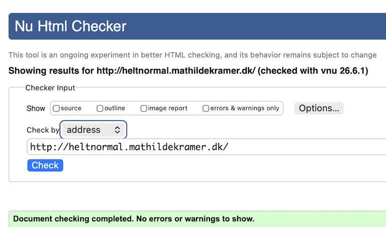
  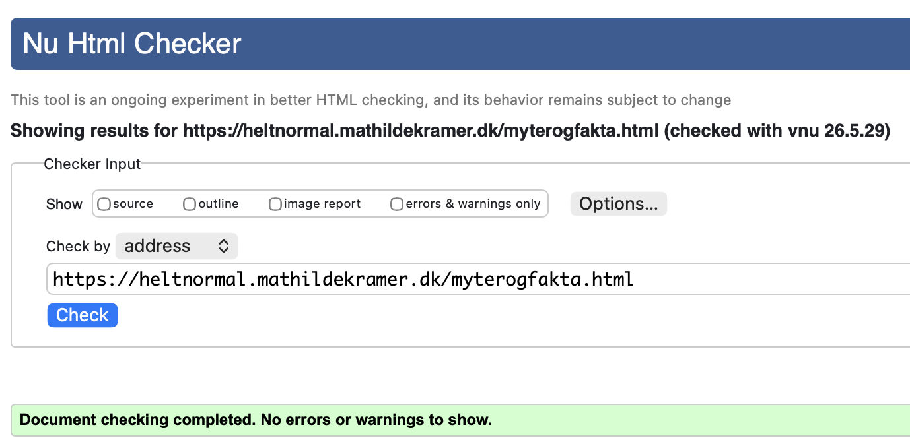
</p>
<p>
  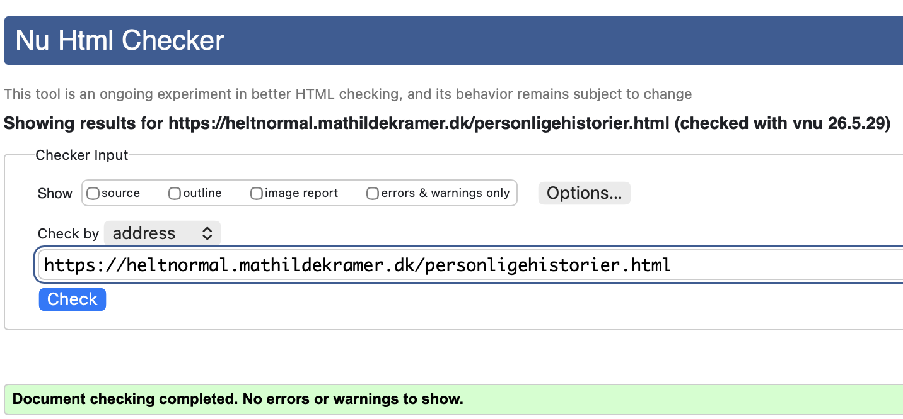
  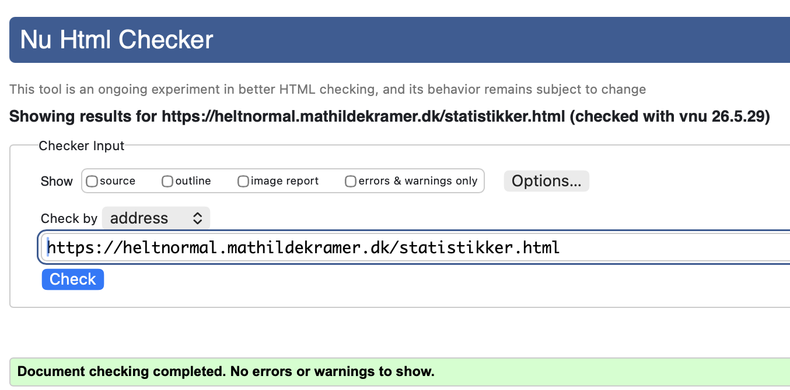
</p>

### CSS validering

<p> 
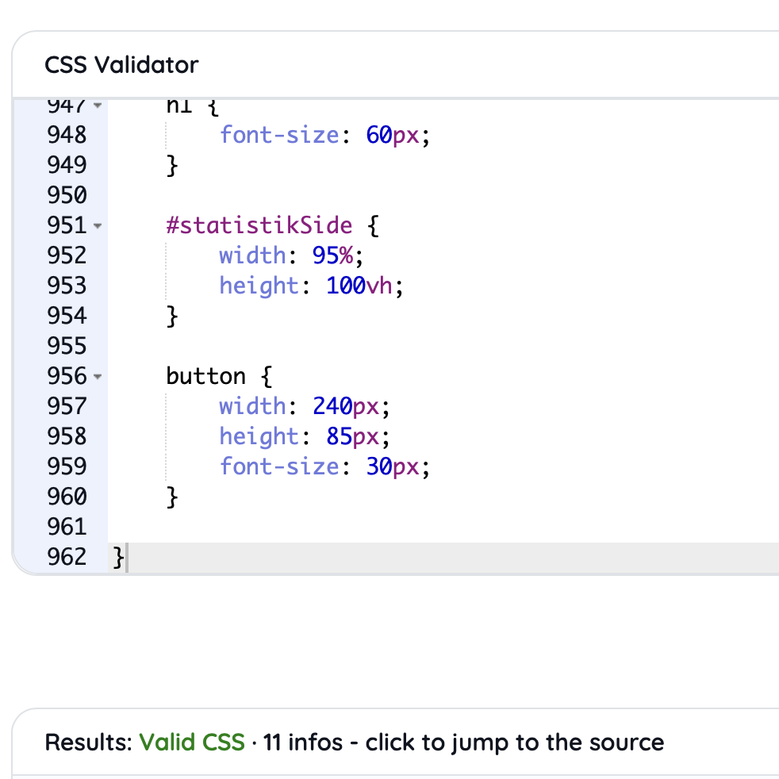
</p>

# Samarbejde og udviklingsproces

## GitHub og samarbejde

Via GitHub har vi kunnet samarbejde om den samme kode. Ved at oprette et repository,
som alle gruppemedlemmer blev inviteret til, kunne vi arbejde i den samme kode samme tid, og blot pushe vores eget arbejde, og hente de andres.

## Fælles kodning

I starten af projektet valgte vi ofte at kode sammen på én computer. På den måde kunne
vi diskutere løsninger, tage fælles beslutninger og sikre, at alle forstod koden og lærte de
forskellige teknikker. Vi skiftede løbende mellem, hvem der sad ved computeren, så alle fik mulighed for at arbejde aktivt med koden og opnå en bedre forståelse af de forskellige teknikker. Selvom kun én person fysisk skrev koden ad
gangen, bidrog alle gruppemedlemmer med idéer, problemløsning og beslutninger.

## Samarbejde om kode

Senere i projektet begyndte vi at arbejde mere parallelt i forskellige filer.
Dette gjorde det muligt at udvikle flere dele af projektet samtidig, imens
vi fortsat koordinerede vores arbejde gennem fælles beslutninger og løbende
gennemgang af hinandens kode. På den måde kunne vi alle få lov at fordybe os i noget
af koden, og lære endnu mere.

GitHub-aktiviteten viser ikke nødvendigvis alt samarbejdet i projektet. En stor del
af udviklingen foregik fælles og derfor afspejler antallet af commits ikke
nødvendigvis den enkelte gruppemedlems bidrag til projektet.

Vi har forsøgt at lave beskrivende commits undervejs, hvor det gav mening.
Vores commits forklarer, hvilke ændringer der er foretaget,
og hvilken betydning de har haft for løsningen.

## Indsigter fra github

Her ses nogle screenshots fra indsigter på GitHub. Her ses det hvordan vi har samarbejdet,
samt hvor mange commits vi hver især har lavet.

<p>
  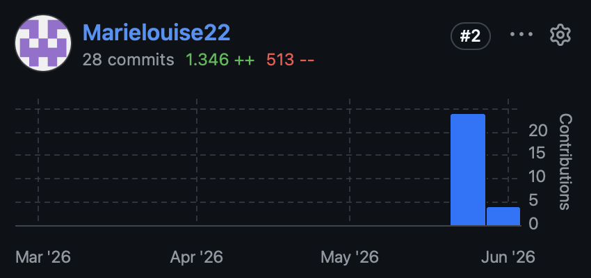
  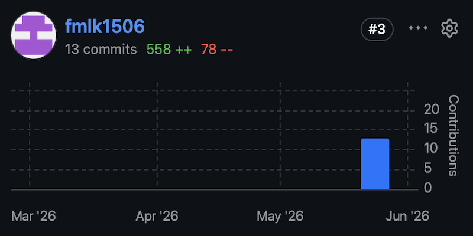
  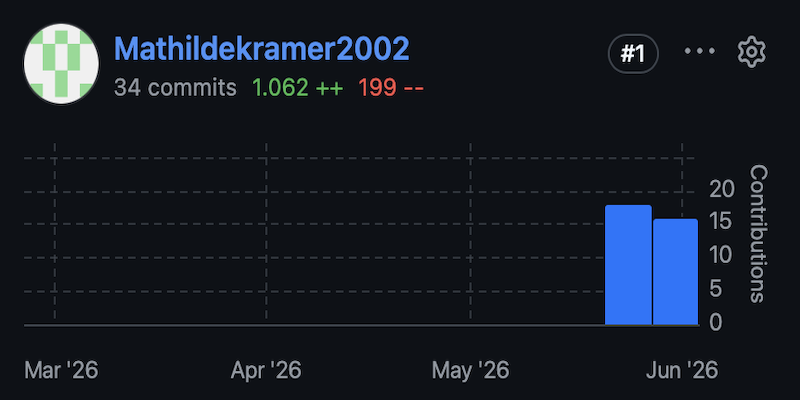
</p>

# Centrale valg i udviklingen

Vi valgte at opbygge vores indhold ud fra JavaScript-arrays, da det gjorde det muligt at generere indhold dynamisk og nemt at vedligeholde løsningen.
Vi valgte desuden at udvikle vores egne knapper til videoerne, så vi kunne tilføje funktioner som brugerdefinerede undertekster og sørge for, at designet passer til resten af hjemmesidens design.
Vi valgte at fokusere på korte interaktive aktiviteter, da målgruppen hurtigt skulle kunne engagere sig i emnet psykisk sygdom.

# Webkonventioner

I vores projekt har vi forsøgt at følge almindelige webkonventioner for,
at gøre koden overskuelig, ensartet og nem at arbejde med.

### Beskrivende Filnavne

- Vi har givet vores HTML-, CSS- og JavaScript-filer beskrivende navne, som indikerer
  deres indhold. På den måde kan vi nemt finde den fil vi skal bruge. Eksempel på filnavne kan ses her:

<p>
 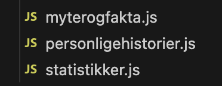 
 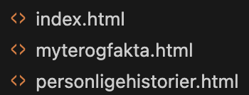 
 </p>

### Mellemrum & (æ,ø,å)

- Vi har undgået mellemrum samt (æ, ø & å) i vores filnavne. Dette har vi gjort for, at reducere risikoen for fejl, og for at undgå problemer med filstier og links mellem filerne.

### Små bogstaver

- Vi har kun brugt små bogstaver i vores fil- og mappenavne. Det gør navngivningen mere ensartet og gør det lettere at linke mellem filerne.
  Eksempler fra projektet er `index.html`, `statistik.html` og `myterogfakta.js`.

### Mappestruktur

- Vi har organiseret vores filer i mapper, så projektet er nemmere at navigere i. Vi har blandt andet en mappe med vores css-fil, en mappe til alle vores JavaScript-filer
  og en mappe der hedder "image", hvor alle vores billeder ligger i,
  samt en mappe med vores vtt-filer med vores undertekster til vores videoer:

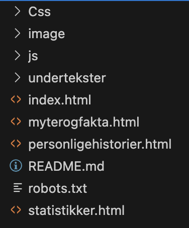

# Navngivning af variabler og funktioner

I vores kode har vi brugt beskrivende navne til vores variabler og funktioner.
Navnene fortæller noget om indholdet af variablen eller hvad funktionen gør.
Alt sammen for at gøre det nemmere for os selv, så vi nemt kan regne ud,
hvad funktionen gør eller hvad variablen indeholder.

### Her er nogle eksempler på variabler fra koden:

```js
const videreBtn = document.querySelector("#videreBtn");
const udsagnListe = [];
let aktueltSporgsmaal = 0;
```

Her gør navnene på vores variabler det lettere at forstå, at `videreBtn` henviser til videre-knappen og `aktueltSporgsmaal` holder styr på,
hvilket spørgsmål brugeren er nået til.

### Eksempler på funktioner

```js
function visSporgsmaal() {
```

```js
function startSpil(){
```

Navnene på vores funktioner gør det nemt at forstå deres formål.
Eksempelvis bruges `visSporgsmaal()` til at vise spørgsmålene på siden,
mens `startSpil()` bruges til at starte spillet.

## Navngivningskonventioner

- I JavaScript har vi brugt camelCase til variabler og funktioner,
  fx `videreBtn`, `udsagnListe` og `visSporgsmaal()`. Det betyder, at det første ord starter med lille bogstav, mens de efterfølgende ord starter med stort bogstav. Det gør navnene lettere at læse, da de forskellige ord bliver tydeligt adskilt uden brug af mellemrum.

# Kode eksempel

### Undertekster på videosiden

Vi har valgt at forklare koden, som gør det muligt for brugeren,
at slå undertekster til og fra på videoerne, som man finder på siden med de personlige historier.

```javascript
let underteksterAktive = false;

undertekstBtn.addEventListener("click", () => {
  underteksterAktive = !underteksterAktive;

  if (underteksterAktive) {
    undertekstBtn.classList.add("aktiv");
  } else {
    undertekstBtn.classList.remove("aktiv");
    customUndertekst.style.display = "none";
  }
});

video.addEventListener("timeupdate", () => {
  const spor = video.textTracks[0];
  spor.mode = "hidden";

  if (underteksterAktive && spor.activeCues.length > 0) {
    customUndertekst.textContent = spor.activeCues[0].text;
    customUndertekst.style.display = "block";
  } else {
    customUndertekst.style.display = "none";
  }
});
```

Først opretter vi variablen `underteksterAktive`, som holder styr på,
om underteksterne er slået til eller fra. Variablen er sat til `false` fra start, hvilket betyder, at underteksterne er skjult, når videoen åbnes.

Herefter bruger vi `undertekstBtn.addEventListener("click")`, som lytter efter klik på undertekst-knappen. Når brugeren klikker på knappen, ændres værdien
af `underteksterAktive` mellem `true` og `false`.
På den måde kan brugeren tænde og slukke for underteksterne.

Inde i `if (underteksterAktive)` tjekker vi, om underteksterne er aktiveret.
Hvis de er det, bliver CSS-klassen `aktiv` tilføjet, ved hjælp af `classList.add()`.
Dette giver brugeren visuel feedback, så de tydeligt kan se, om funktionen er slået til eller fra.

i `else-blokken` fjernes klassen igen med `classList.remove()`, og undertekstfeltet skjules med `display: none`, så teksten ikke vises på skærmen længere.

`video.addEventListener("timeupdate")` kører løbende, mens videoen spiller.
Her henter vi videoens undertekstspor med `video.textTracks[0]` og
skjuler standardunderteksterne ved hjælp af `spor.mode = "hidden"`.

Vi undersøger om underteksterne er slået til, og om der findes en aktiv undertekst på det aktuelle tidspunkt af videoen. Hvis begge betingelser er opfyldt, så indsættes teksten i vores eget undertekstfelt, ved hjælp af `customUndertekst.textContent`, og feltet bliver vist på skærmen.

Hvis der ikke findes en aktiv undertekst, eller hvis brugeren har slået underteksterne fra, så skjules undertekstfeltet igen.

Vi har valgt denne løsning for at gøre de personlige fortællinger mere tilgængelige. Nogle brugere har lettere ved at følge historien, når de både kan høre og læse indholdet. Samtidig giver funktionen brugeren mulighed for selv at vælge, om underteksterne skal vises. Dette giver brugeren mulighed for selv at vælge, om de vil have undertekster på eller ej

# Relevante JavaScript-teknologier

I projektet har vi anvendt flere centrale JavaScript-teknologier og metoder. Vi har blandt andet brugt arrays og objekter til at strukturere vores data. Eksempelvis til de personlige historier. Derudover har vi anvendt DOM-manipulation til at oprette og ændre indhold på siden dynamisk.

Ved hjælp af `addEventListener()` har vi gjort løsningen interaktiv, så brugeren kan starte quizzer, styre videoer og slå undertekster til og fra. Vi har også anvendt `if/else-strukturer` og `booleans` til at håndtere forskellige tilstande og brugerhandlinger.

# ORCA tabel

Vi har brugt ORCA metoden til at identificere de vigtigste objekter i vores løsning. Vi har primært fokuseret på O og A, altså vores objekter samt deres tilhørende attributter. Dette har vi gjort på både forsiden og de 3 undersider "Myter eller fakta", "Statistikker" og "Personlige historier".

### Eksempel på ORCA tabel

Her ses et eksempel på den ORCA tabel vi lavede til vores personlige historier-side, hvor man finder videoerne. Her har vi defineret vores objekter som er fortællingerne, samt deres attributter som fx. id, navn, alder osv.

| Objekt/Attributter | Id  | Navn    | Alder | Diagnose | Billede | Video  | Kort tekst | Undertekster |
| ------------------ | --- | ------- | ----- | -------- | ------- | ------ | ---------- | ------------ |
| fortælling 1       | 1   | Anna    | 19 år | Angst    | img/..  | mp4/.. | ""         | vtt/..       |
| fortælling 2       | 2   | sofia   | 8 år  | Autisme  | img/..  | mp4/.. | ""         | vtt/..       |
| fortælling 3       | 3   | Cecilie | 25 år | ADHD     | img/..  | mp4/.. | ""         | vtt/..       |

Vi har efterfølgende omsat vores ORCA-tabel til et array i vores JavaScript struktur. Hver historie er repræsenteret som objekter, og attributterne som properties.

# Eksempel på array

Her er et eksempel på hvordan, vores ORCA-tabel ser ud, efter vi har omsat den til et array i vores JavaScript

```javascript
const historier = [
  {
    id: 1,
    navn: "Anna",
    alder: "19 år",
    diagnose: "Angst",
    billede: "image/anna.png",
    video: "image/video/anna.mp4",
    kortTekst:
      "I lang tid troede jeg bare, at jeg tænkte for meget over tingene.",
    undertekst: "undertekster/anna.vtt",
  },
];
```

På denne måde fungerer ORCA-tabellen som grundlaget for den datastruktur,
vi anvender i vores JavaScript-kode. På den måde bruges dataene til dynamisk at generere indholdet på siden ved hjælp af JavaScript, så nye historier kan tilføjes uden at ændre HTML-strukturen.

### Datatyper i vores array

På vores side med de personlige historier anvender vi forskellige datatyper i vores datastruktur:

| Property   | Datatype |
| ---------- | -------- |
| id         | Number   |
| navn       | String   |
| alder      | String   |
| diagnose   | String   |
| billede    | String   |
| video      | String   |
| kortTekst  | String   |
| undertekst | String   |

Selve variablen `historier` er et array, som indeholder flere objekter.
Hver historie er repræsenteret som et objekt, hvor attributterne fra ORCA-tabellen, er blevet omsat til properties med forskellige datatyper.

### Andre datatyper

I vores datastrukturer anvender vi primært datatyperne String og Number, som også ses ovenfor.

I vores JavaScript-kode anvender vi også datatypen boolean, som kun
kan have værdien `true` eller `false`. Vi har derfor brugt den til de funktionerne, der kun har to mulige tilstande, som fx vores undertekster.

### Eksempel fra vores løsning

```javascript
let underteksterAktive = false;

undertekstBtn.addEventListener("click", () => {
  underteksterAktive = !underteksterAktive;
});
```

Variablen `underteksterAktive` er en Boolean og bruges til at holde styr på,
om underteksterne på videoen er slået til eller fra. Variablen starter med værdien `false`, hvilket betyder, at underteksterne er skjult når brugeren åbner videoen. Når brugeren klikker på undertekst-knappen, ændres værdien til det modsatte ved hjælp af `!`. Det betyder altså, at hvis værdien er `true`,
så vises underteksterne, og hvis værdien er `false`, så skjules de.

På den måde gør Boolean-datatypen det muligt for programmet hele tiden at vide,
hvilken tilstand funktionen befinder sig i.

# Kommentarer i koden

Vi har anvendt kommentarer i alle filer, så både i HTML, JavaScript og CSS.
Dette har vi gjort for at holde koden overskuelig, samt lettere for os at forstå. Vi har beskrevet i kommentarene hvad den efterfølgene kode gør,
og på den måde gjort det nemt at navigerere i, både for os selv, men også for andre.

Med kommentarer har vi også kunne dele vores kode op i nogle små sektioner,
så man ved hvor man skal lede hvis man nu leder efter en specifik funktion.

### Eksempel

Et eksempel ses i vores JavaScript-kode til play/pause-knappen på videoen:

```javascript
// Her laver vi funktionen til vores play/pause knap
playPauseBtn.addEventListener("click", () => {
  // Her gør vi så når videon spiller, vil den pause, og omvendt når man trykker på vores knap

  if (video.paused) {
    video.play();

    // Her ændrer vi ikonet til en pause knap, hvis videon spiller
    playPauseBtn.textContent = "❚❚";
  } else {
    video.pause();
    // Når videon er sat på pause, bliver ikonet igen til play
    playPauseBtn.textContent = "▶";
  }
});
```

I dette eksempel forklarer kommentarerne både, hvad de enkelte kodestykker gør, og hvorfor de er nødvendige.
Kommentarerne gør det lettere at forstå logikken bag funktionen, da man hurtigt kan se,
hvordan knappen styrer videoafspilningen og skifter ikon mellem play og pause.
Vi har forsøgt at skrive beskrivende kommentarer gennem hele projektet,
så både vi selv og andre lettere kan læse, forstå og vedligeholde koden.

# JavaScript libraries

Vi har ikke anvendt tredjeparts JavaScript-biblioteker i dette projekt. Alt er udviklet ved hjælp af vanilla JavaScript.

# Brugen af AI-værktøjer

I udviklingen af vores prototype har vi benyttet ChatGPT som et sparrings- og læringsværktøj.
ChatGPT har fungeret som et hjælpeværktøj undervejs i projektet. Vi har blandt andet brugt det til at få forklaret tekniske begreber, fejlfinde i kode og få idéer til, hvordan vi kunne løse forskellige udfordringer

Værktøjet har fungeret som en støtte gennem projektforløbet, men alle løsninger er blevet vurderet, tilpasset og implementeret af os selv. Formålet med brugen af ChatGPT har været at understøtte vores læring og hjælpe os videre i situationer, hvor vi havde brug for sparring eller en ny indgangsvinkel til en udfordring.

Nedenstående links viser udvalgte eksempler på, hvordan ChatGPT er blevet anvendt i projektet. Eksemplerne repræsenterer forskellige typer af sparring og er ikke en fuld liste over alle de samtaler, der har fundet sted i løbet af udviklingsprocessen.

## Links

Her er nogle links til de chats, der er blevet brugt til at hjælpe os i mål med vores løsning

- ### Undertekster

  https://chatgpt.com/share/6a246c36-2164-83eb-8b67-301ef9dc3ce1

- ### Vtt filer

  https://chatgpt.com/share/6a246d4f-2b04-83eb-9660-2359108bd29c

- ### Hjælp til at komme i gang med statistik siden

  https://chatgpt.com/share/6a24726d-5708-83eb-8735-9c090547fc0b

- ### Fejlfinding i kode
  https://chatgpt.com/share/6a24757b-83b4-83eb-a79b-3699bf20f97e

De delte samtaler er inkluderet for at skabe gennemsigtighed omkring brugen af AI i projektet og for at dokumentere, hvordan ChatGPT har været anvendt som et understøttende værktøj i vores arbejdsproces.
